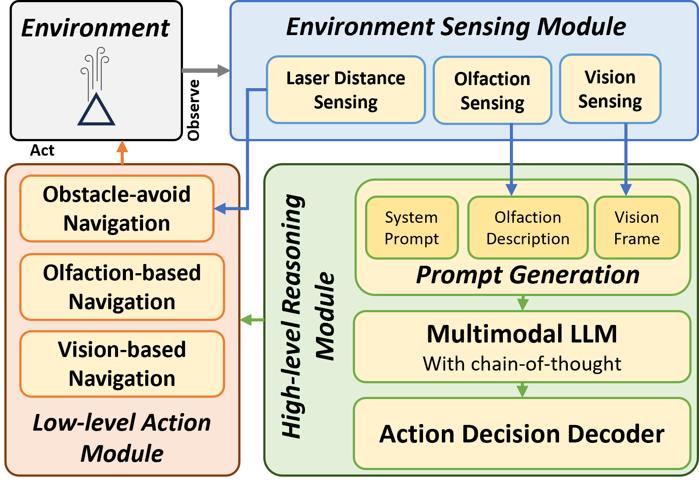

# Integrating Vision and Olfaction via Multi-modal LLM for Robotic Odor Source Localization
> Code release for our [Sensors](https://www.mdpi.com/journal/sensors) publication.

[Project page](https://sunzidhassan.github.io/24_Vision-Olfaction-LLM_PP/) | [Preprint]()

[Sunzid Hassan]() |
[Lingxiao Wang]() |
[Khan Raqib Mahmud]() |


## 🔍 Framework Overview
<p align="center">
	
</p>
Odor Source Localization (OSL) technology allows autonomous agents like mobile robots to find an unknown odor source in a given environment. Compared to traditional olfaction-only OSL method, our proposed method integrates vision and olfaction sensor modalities to localize odor sources even if olfaction sensing is disrupted by turbulent airflow or vision sensing is impaired by environmental complexities. A key feature of the proposed algorithm is the `High-level Reasoning' module, which encodes the olfaction and vision sensor data into a multi-modal prompt and instructs the LLM to employ a hierarchical reasoning process to select an appropriate high-level navigation behavior. Subsequently, the `Low-level Action' module translates the selected high-level navigation behavior into low-level action commands that can be executed by the mobile robot.

## 🚀 Getting Started
### 1. Requirements

We recommend setting up a python virtualenv or conda environment to help manage dependencies. Our code has been tested primarily with Python 3.12.

Sample instruction for `conda` users.
```bash
conda create -n `llmosl` python=3.12.4
conda activate `llmosl`
pip install -r requirements.txt
```

### 2. Configuration ⚙️ 
All configurable parameters are located in `config.yaml`.

Before running `llmosl`, make sure to set up your OpenAI API keys. Please note that using the OpenAI API will incur costs ($$$).

Configure as below in `config.yaml`:
```yaml
OPENAI_KEY: # 'sk-xxxxxx' 
OPENAI_CHAT_MODEL: 'gpt-4o'
```
[Alternative Models](https://platform.openai.com/docs/models)

### 3. Running `llmosl`
Running `llmosl` is straightforward:
```bash
python LLM_demo.py
```
The user will be asked for an integer timestamp from 1 to 13. This will select a pair of vision-olfaction data point. This data will be used to generate a prompt for quering the `High-level Reasoning` Module.

The program will generate the output, show the image used for the prompt for 5 seconds, and terminate.

## 🔖 Citation

## 📝 License